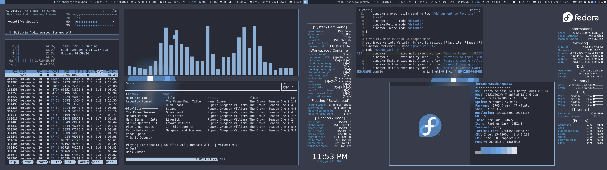
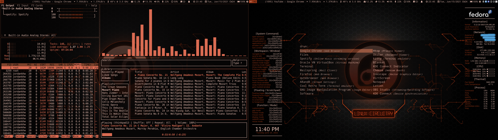
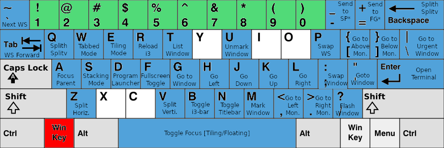
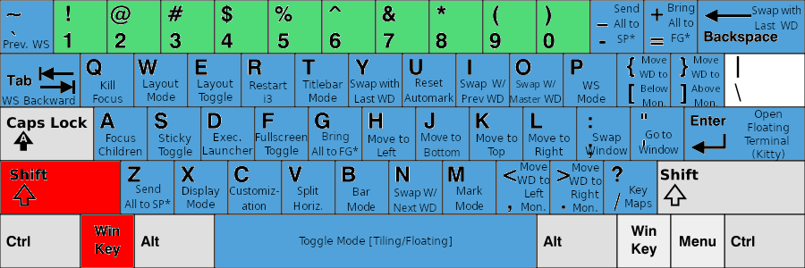
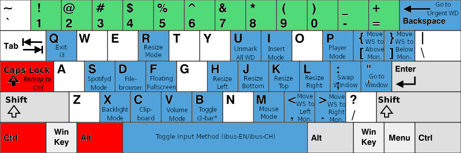

# I3_Sway_Config
Backup for my I3WM(Xorg), SwayWM(Wayland), and other applications configuration

Table of Contents
=================

<details open>
<summary>Click to expand!</summary>

* [I3_Sway_Config](#i3_sway_config)
* [Table of Contents](#table-of-contents)
* [Context](#context)
   * [Demo Current Customization](#demo-current-customization)
   * [Information for my i3 Configuration](#information-for-my-i3-configuration)
      * [My i3 Environment](#my-i3-environment)
      * [Programs Auto-start in Background for i3 Environment](#programs-auto-start-in-background-for-i3-environment)
      * [Wallpapers](#wallpapers)
      * [Theme and Fonts](#theme-and-fonts)
   * [First Time Usage for i3](#first-time-usage-for-i3)
      * [Configuration deployer](#configuration-deployer)
      * [Optional Configuration](#optional-configuration)
   * [Keybinding Sheet for i3](#keybinding-sheet-for-i3)
      * [Prefix: [Winkey]](#prefix-winkey)
      * [Prefix: [Winkey] + [Shift]](#prefix-winkey--shift)
      * [Prefix: [Ctrl] + [Alt]](#prefix-ctrl--alt)
      * [Miscellaneous](#miscellaneous)
      * [Mode Usage](#mode-usage)
   * [Reference](#reference)

Created by [gh-md-toc](https://github.com/ekalinin/github-markdown-toc)

</details>

# Context
<details open>
<summary>Click to expand!</summary>

## Demo Current Customization
<details open>
<summary>Click to expand!</summary>




</details>

## Information for my i3 Configuration
<details open>
<summary>Click to expand!</summary>

### My i3 Environment
<details open>
<summary>Click to expand!</summary>

- Shell: [fish](https://github.com/fish-shell/fish-shell) + [oh-my-fish](https://github.com/oh-my-fish/oh-my-fish)
- Terminal: [kitty](https://github.com/kovidgoyal/kitty)
- Launcher: [rofi](https://github.com/davatorium/rofi)
- Theme configurer: [pywal](https://github.com/dylanaraps/pywal)
- Xcompositor: [picom](https://github.com/jonaburg/picom)
- Notification: [dunst](https://github.com/dunst-project/dunst)
- Status Bar: [default i3bar](https://i3wm.org/docs/userguide.html#_configuring_i3bar) + [bumblebee-status](https://github.com/tobi-wan-kenobi/bumblebee-status)
- Text Editor: [neovim](https://github.com/neovim/neovim) + [my configuration](https://github.com/JordanWu1997/Vim_Tmux_Config)
- Terminal Multiplexer: [tmux](https://github.com/tmux/tmux) + [my configuration](https://github.com/JordanWu1997/Vim_Tmux_Config)

</details>

### Programs Auto-start in Background for i3 Environment
<details open>
<summary>Click to expand!</summary>

- [xrandr](https://www.x.org/wiki/Projects/XRandR/): multi-monitor window arrangement
- [pywal](https://github.com/dylanaraps/pywal): color theme autotune by wal
- [feh](https://github.com/derf/feh): image viewer, wallpaper changer
- [conky](https://github.com/brndnmtthws/conky): system monitor for X window
- [polkit-gnome](https://fedora.pkgs.org/33/fedora-x86_64/polkit-gnome-0.106-0.7.20170423gita0763a2.fc33.x86_64.rpm.html): gnome software support
- [NetworkManger](https://fedoraproject.org/wiki/Tools/NetworkManager): network manager
- [blueman](https://fedoraproject.org/wiki/Features/Blueman): bluetooth manger
- [imwheel](http://imwheel.sourceforge.net/): mouse speed manager
- [ibus-chewing](https://github.com/definite/ibus-chewing): input method for chewing
- [xss-lock](https://bitbucket.org/raymonad/xss-lock/src/master/): Xsession lock
- [parcellite](https://github.com/rickyrockrat/parcellite): clipboard applet
- [flashfocus](https://github.com/fennerm/flashfocus): flash when changing focus
- [dunst](https://github.com/dunst-project/dunst): notification
- [kdeconnectd](https://community.kde.org/KDEConnect): mobile phone connector
- [bumblebee-status](https://github.com/tobi-wan-kenobi/bumblebee-status): i3 status bar information support
- [rjekker/i3-battery-popup](https://github.com/rjekker/i3-battery-popup): battery warning for laptop
- [lincheney/i3_automark.py](https://github.com/lincheney/i3-automark/blob/master/i3-automark.py): auto mark i3 window
- [nwg-piotr/autotiling.py](https://github.com/nwg-piotr/autotiling): auto tiling i3 container (Horizontal -> Vertical -> Horizontal -> ...)
- [jonaburg/picom](https://github.com/jonaburg/picom): Xcompositor for blur, transparency, animation support

</details>

### Wallpapers
<details open>
<summary>Click to expand!</summary>

- Default Wallpapers: [Arc Dark Fedora Wallpaper](https://www.reddit.com/r/Fedora/comments/8zji6j/by_request_clean_and_simple_arc_dark_fedora/)
- Default Lock screen wallpaper: [Thinkpad Trackpoint Wallpaper](https://www.wallpaperflare.com/thinkpad-lenovo-full-frame-close-up-no-people-pattern-indoors-wallpaper-hivip)
- [Optional] More wallpapers from dt: [Wallpapers](https://gitlab.com/dwt1/wallpapers)
- [Optional] Fedora 33/34 built-in logo: [Logos](https://en.wikipedia.org/wiki/Fedora_(operating_system))

</details>

### Theme and Fonts
<details open>
<summary>Click to expand!</summary>

- [Optional] Theme: [Arc-Dark-solid](https://github.com/horst3180/arc-theme)
- [Optional] Icon: [Papirus dark](https://www.gnome-look.org/p/1166289/)
- [Optional] GUI font: [SAN regular](https://fonts.google.com/specimen/Open+Sans)
- [Optional] TUI font: [DroidSansMono Nerd Font Bold](https://github.com/ryanoasis/nerd-fonts/blob/master/patched-fonts/DroidSansMono/complete/Droid%20Sans%20Mono%20Nerd%20Font%20Complete%20Mono.otf)

</details>

## First Time Usage for i3
<details>
<summary>Click to expand!</summary>

### Configuration deployer
- Run deployer in git repository `config/i3/script/i3_config_deployer.sh`
- Including
    - __Add Environment Variables__
        - Add `I3_SCRIPT` to `$PATH` in `$HOME/.profile`
        - Add `I3_SCRIPT` in `"$HOME/.profile`
    - __Backup Old Configuration and Link New Configuration__
        - Backup old configuration file `$HOME/.config/*` to `$HOME/.config_backup` directory
        - Link configuration in git repository `config/*` to `$HOME/.config` directory

### Optional Configuration
- [Optional] Add following lines for pywal color support for bash/zsh/fish, no need for kitty terminal emulator
    ```
    # Add following line to .bashrc/.zshrc/config.fish
    [ -f {$HOME}/.cache/wal/sequences ] && /usr/bin/cat {$HOME}/.cache/wal/sequences
    ```

</details>

## Keybinding Sheet for i3
<details>
<summary>Click to expand!</summary>

- Cheat sheet format, color theme here is the same as i3 user guide

### Prefix: [Winkey]


### Prefix: [Winkey] + [Shift]


### Prefix: [Ctrl] + [Alt]

- __Program shortcut (1~9, 0, -, =)__
    - All following shortcuts can be modified in config file, modify as you wish
        - 1: [Neovim (text editor)](https://neovim.io/)
        - 2: [Ranger (file manager)](https://github.com/ranger/ranger)
        - 3: [Pulsemixer (sound manager)](https://pypi.org/project/pulsemixer/)
        - 4: [Htop (system monitor)](https://htop.dev/)
        - 5: [Nmtui (network manager)](https://developer.gnome.org/NetworkManager/stable/nmtui.html)
        - 6: [Cava (visualizer)](https://github.com/karlstav/cava)
        - 7: [Spt (spotify-tui)](https://github.com/Rigellute/spotify-tui)
        - 8: [Zathura (document viewer)](https://github.com/pwmt/zathura)
        - 9: [Blueman (bluetooth manager)](https://github.com/blueman-project/blueman)
        - 0: [Nautilus (gui file manager)](https://wiki.gnome.org/action/show/Apps/Files?action=show&redirect=Apps%2FNautilus)
        - -: [Brave browser (web browser)](https://brave.com/)
        - =: [Firefox (web browser)](https://www.mozilla.org/en-US/firefox/)

### Miscellaneous
- __Go to Workspace__
    - `[Winkey] + [Number(#)]`: Go to workspace number # (A#) in monitor 1 (eDP1)
    - `[Winkey] + [Function(F#)]`: Go to workspace number 10+# (B#) in monitor 2 (HDMI1)
    - `[Ctrl] + [Function(#)]`: Go to workspace number 20+# (C#) in monitor 3 (VIRTUAL1)
    - `[Alt] + [Function(#)]`: Go to workspace number 30+# (D#) in monitor 4 (VIRTUAL2)
- __Send Window to Workspace__
    - `[Winkey] + [Shift] + [Number(#)]`: Send to workspace number # (A#) in monitor 1 (eDP1)
    - `[Winkey] + [Shift] + [Function(F#)]`: Send to workspace number 10+# (B#) in monitor 2 (HDMI1)
    - `[Ctrl] + [Shift] + [Function(F#)]`: Send to workspace number 20+# (C#) in monitor 3 (VIRTUAL1)
    - `[Alt] + [Shift] + [Function(F#)]`: Send to workspace number 30+# (D#) in monitor 4 (VIRTUAL2)
    - `[Alt] + ([Shift]) + [Grave]`: Send to (prev)/next workspace
- __Move between Windows__
    - `[Alt] + [Tab]`: Show all window list
- __Manipulate Scratchpad__
    - `[Winkey] + [-]`: Send focus to scratchpad (background)
    - `[Winkey] + [Shift] + [-]`: Send all floating windows to scratchpad (background)
    - `[Winkey] + [=]`: Bring window in scratchpad to foreground one by one
    - `[Winkey] + [Shift] + [=]`: Bring all windows in scratchpad to foreground
- __Change Gap Size__
    - `[Ctrl] + [Alt] + [h/l]`: Dec/Inc horizontal outer gap size
    - `[Ctrl] + [Alt] + [j/k]`: Dec/Inc vertical outer gap size
    - `[Ctrl] + [Alt] + [m/p]`: Dec/Inc inner gap size
    - `[Ctrl] + [Alt] + [o]`: Restore to default outer gap size
    - `[Ctrl] + [Alt] + [i]`: Restore to default inner gap size

### Mode Usage
- __System mode (`[Winkey] + [Shift] + [Esc]`)__
    - system command, e.g. exit, poweroff, reboot, lock, hibernate
- __Display mode (`[Winkey] + [Shift] + [x]`)__
    - deal with dual monitor, e.g. joint monitor, mirror monitor
- __Red shift mode (`[Winkey] + [Shift] + [z]`)__
    - screen color temperature tuner
- __Dunst mode (`[Winkey] + [Shift] +[v]`)__
    - dunst actions, including stopping or resuming dunst
- __Mouse mode (`[Ctrl] + [Alt] + [m]`)__
    - mouse emulator using keyboard, e.g. move, left/right click, cursor auto-hide
- __Resize mode (`[Ctrl] + [Alt] + [r]`)__
    - resize focus window
- __Gap mode (`[Winkey] + [Shift] + [g]`)__
    - modify i3 gaps, e.g. inner gaps, outer gaps
- __Title bar mode (`[Winkey] + [Shift] + [t]`)__
    - modify i3 title bar, e.g. hide/show title bar, font, border
        - __Border mode (`[b]`)__
            - modify i3 border
- __Mark mode (`[Winkey]` + `[Shift]` + `[m]`)__
    - mark window, goto/swap marked window, auto-mark function
- __Window layout mode (`[Winkey]` + `[Shift]` + `[w]`)__
    - change i3 window layout, e.g. tiling, tabbed, stacking mode, auto-tiling function
- __Workspace mode (`[Winkey] + [Shift] + [p]`)__
    - manipulate i3 workspace, e.g. swap, save, restore
        - __Swap_workspace mode (`[p]`)__
            - Swap workspace
        - __Save_workspace mode (`[s]`)__
            - Save workspace layout
        - __Restore_workspace mode (`[r]`)__
            - Restore workspace layout
- __Customization mode (`[Winkey] + [Shift] + [c]`)__
    - customize i3wm, e.g. wallpaper, theme, xcompositor
        - __Conky mode (`[c]`)__
            - system_conky, hotkey_conky, color of conky
        - __Picom mode (`[p]`)__
            - blur, transparency support
        - __Flashfocus mode (`[f]`)__
            - flash for overall program in picom blur, transparency and opaque
        - __Theme mode (`[t]`)__
            - auto-theme with pywal and applications reloading after auto-theming
        - __Wallpaper mode (`[w]`)__
            - select wallpaper, set default wallpaper

### Touchpad Usage
- __3-finger gesture__
    - __Swipe up__
        - Toggle window full-screen mode
    - __Swipe down__
        - Toggle floating mode
    - __Swipe left__
        - Go to previous workspace
    - __Swipe right__
        - Go to next workspace
- __4-finger gesture__
    - __Pinch out__
        - Bring scratchpad window to foreground
    - __Pinch in__
        - Send window to scratchpad

</details>

## Reference
<details>
<summary>Click to expand!</summary>

- https://i3wm.org/docs/userguide.html
- https://github.com/levinit/i3wm-config
- https://www.itread01.com/p/142448.html
- https://medium.com/@mudrii/archlinux-tutorial-part-3-i3-configuration-and-op
- https://github.com/alberto-santini/i3-configuration-x1
- https://segmentfault.com/a/1190000022083424
- https://github.com/Airblader/i3 (i3-gap)
- https://pypi.org/project/i3-resurrect/
- https://pypi.org/project/i3-workspace-swap/
- https://github.com/rjekker/i3-battery-popup
- https://github.com/lincheney/i3-automark

</details>
</details>
