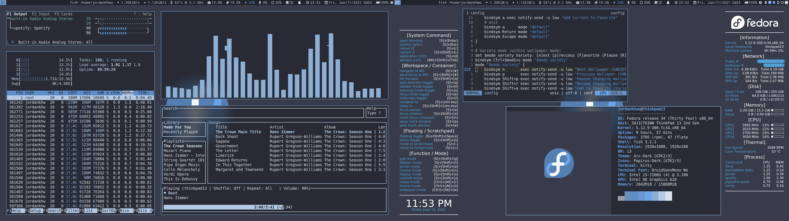
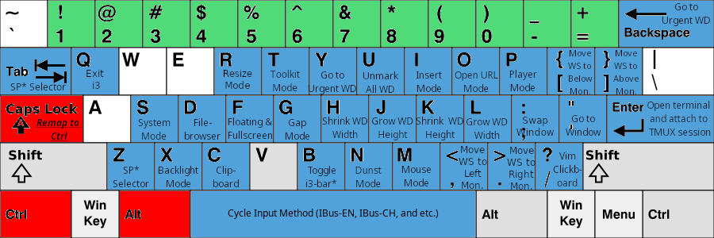

# I3_Sway_Config
Backup for my I3WM (Xorg) and Sway (Xwayland) configuration

Table of Contents
=================

* [I3_Sway_Config](#i3_sway_config)
   * [Demo Current Customization Result for i3](#demo-current-customization-result-for-i3)
   * [Preparation (Dependence) for i3](#preparation-dependence-for-i3)
   * [First Time Usage for i3](#first-time-usage-for-i3)
   * [Autostart Programs for i3](#autostart-programs-for-i3)
   * [Keybinding Sheet for i3](#keybinding-sheet-for-i3)
      * [Prefix: Winkey](#prefix-winkey)
      * [Prefix: Winkey + Shift](#prefix-winkey--shift)
      * [Prefix: Ctrl + Alt](#prefix-ctrl--alt)
      * [Miscellaneous:](#miscellaneous)
      * [Mode Usage:](#mode-usage)
   * [Reference](#reference)

## Demo Current Customization Result for i3


## Preparation (Dependence) for i3
1. Software list
- Shell: [fish](https://github.com/fish-shell/fish-shell) + [oh-my-fish](https://github.com/oh-my-fish/oh-my-fish)
- Terminal: [kitty](https://github.com/kovidgoyal/kitty)
- Launcher: [rofi](https://github.com/davatorium/rofi)
- Theme configurator: [pywal](https://github.com/dylanaraps/pywal)
- Xcompositor: [picom](https://github.com/jonaburg/picom)
- Notification: [dunst](https://github.com/dunst-project/dunst)
- Status Bar: [default i3bar](https://i3wm.org/docs/userguide.html#_configuring_i3bar) + [bumblebee-status](https://github.com/tobi-wan-kenobi/bumblebee-status)
- Text Editor: [neovim](https://github.com/neovim/neovim) + [my configuration](https://github.com/JordanWu1997/Vim_Tmux_Config)

2. Wallpapers
- Default Wallpapers: [Arc Dark Fedora Wallpaper](https://www.reddit.com/r/Fedora/comments/8zji6j/by_request_clean_and_simple_arc_dark_fedora/)
- Default Lockscreen wallpaper: [Thinkpad Trackpoint Wallpaper](https://www.wallpaperflare.com/thinkpad-lenovo-full-frame-close-up-no-people-pattern-indoors-wallpaper-hivip)
- [Optional] More wallpapers from dt: [Wallpapers](https://gitlab.com/dwt1/wallpapers)
- [Optional] Fedora 33/34 built-in logo: [Logos](https://en.wikipedia.org/wiki/Fedora_(operating_system))

## First Time Usage for i3
1. $HOME/.profile (PATH/VARIABLES)
- Add PATH and I3_BIN to ~/.profile
    ```
    # Add following lines to ~/.profile
    export PATH=$HOME/.config/i3/bin:$PATH
    export PATH=$HOME/.local/bin:$PATH
    export I3_BIN=$HOME/.config/i3/bin
    ```

2. $HOME/.config (CONFIGURATION)
- Link/copy config directories/files under ~/.config
    ```
    # Link or copy following lines to ~/.config
    # If is already a config file in ~/config, remove it first
    cd ~/.config/ && rm -fr i3 kitty dunst ranger rofi picom bumblebee-status vis conky
    ln -s ~/Desktop/I3_Sway_Config/config/i3
    ln -s ~/Desktop/I3_Sway_Config/config/kitty/
    ln -s ~/Desktop/I3_Sway_Config/config/dunst
    ln -s ~/Desktop/I3_Sway_Config/config/ranger
    ln -s ~/Desktop/I3_Sway_Config/config/rofi
    ln -s ~/Desktop/I3_Sway_Config/config/picom
    ln -s ~/Desktop/I3_Sway_Config/config/bumblebee-status
    ln -s ~/Desktop/I3_Sway_Config/config/vis
    ln -s ~/Desktop/I3_Sway_Config/config/conky
    ```

3. $HOME/dotfile (SHELL CONFIGURATION)
- Add following lines for pywal color support for bash/zsh/fish
    ```
    # Add following line to .bashrc/.zshrc/config.fish
    [ -f {$HOME}/.cache/wal/sequences ] && /usr/bin/cat {$HOME}/.cache/wal/sequences
    ```

## Autostart Programs for i3
- [xrandr](https://www.x.org/wiki/Projects/XRandR/): multi-monitor window arrangement
- [pywal](https://github.com/dylanaraps/pywal): colortheme autotune by wal
- [conky](https://github.com/brndnmtthws/conky): system monitor for Xwindow
- [polkit-gnome](https://fedora.pkgs.org/33/fedora-x86_64/polkit-gnome-0.106-0.7.20170423gita0763a2.fc33.x86_64.rpm.html): gnome software support
- [NetworkManger](https://fedoraproject.org/wiki/Tools/NetworkManager): network manager
- [blueman](https://fedoraproject.org/wiki/Features/Blueman): bluetooth manger
- [imwheel](http://imwheel.sourceforge.net/): mouse speed manager
- [ibus-chewing](https://github.com/definite/ibus-chewing): input method for chewing
- [xss-lock](https://bitbucket.org/raymonad/xss-lock/src/master/): Xsession lock
- [parcellite](https://github.com/rickyrockrat/parcellite): clipboard applet
- [flashfocus](https://github.com/fennerm/flashfocus): flash when changing focus
- [dunst](https://github.com/dunst-project/dunst): notification
- [kdeconnectd](https://community.kde.org/KDEConnect): mobile phone connector
- [bumblebee-status](https://github.com/tobi-wan-kenobi/bumblebee-status): i3 status bar information support
- [rjekker/i3-battery-popup](https://github.com/rjekker/i3-battery-popup): battery warning for laptop
- [lincheney/i3_automark.py](https://github.com/lincheney/i3-automark/blob/master/i3-automark.py): automark i3 window
- [jonaburg/picom](https://github.com/jonaburg/picom): Xcompositor for blur, transparency, animation support

## Keybinding Sheet for i3

### Prefix: Winkey


### Prefix: Winkey + Shift


### Prefix: Ctrl + Alt


### Miscellaneous:
- Alt + Tab: Show current workspace window list
- Alt + Shift + Tab: Show window list through all workspaces
- Winkey + Number(#): Goto workspace number # in monitor1
- Winkey + Function(F#): Goto workspace number 10+# in monitor2
- Winkey + Shift+Number: Send to workspace number # in monitor1
- Winkey + Shift+Function: Send to workspace number 10+# in monitor2

### Mode Usage:
- __System mode (Win+Shift+Esc):__ system command, e.g. exit, poweroff, reboot, lock, hibernate
- __Display mode (Win+Shift+x):__ deal with dual monitor, e.g. joint monitor, mirror monitor
- __Mouse mode (Win+Shift+m):__ mouse emulator using keyboard
- __Redshift mode (Win+Shift+z):__ screen color temperature tuner
- __Resize mode (Ctrl+Alt+r):__ resize focus window
- __Gap mode (Win+Shift+g):__ modify i3 gaps e.g. inner gaps, outer gaps
- __Titlebar mode (Win+Shift+t):__ modify i3 titlebar
    - __Border mode:__ modify i3 border
    - __Mark mode:__ mark window, automark function
- __Customization mode (Win+Shift+c):__ customize for i3wm
    - __Theme mode:__ auto-theme with pywal
    - __Wallpaper mode:__ select wallpaper
    - __Picom mode:__ blur, transparency support

## Reference
- https://i3wm.org/docs/userguide.html
- https://github.com/levinit/i3wm-config
- https://www.itread01.com/p/142448.html
- https://medium.com/@mudrii/archlinux-tutorial-part-3-i3-configuration-and-op
- https://github.com/alberto-santini/i3-configuration-x1
- https://segmentfault.com/a/1190000022083424
- https://github.com/Airblader/i3 (i3-gap)
- https://pypi.org/project/i3-resurrect/
- https://pypi.org/project/i3-workspace-swap/
- https://github.com/rjekker/i3-battery-popup
- https://github.com/lincheney/i3-automark
