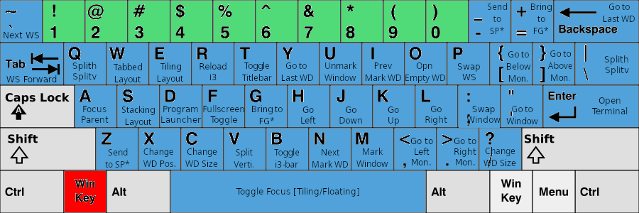
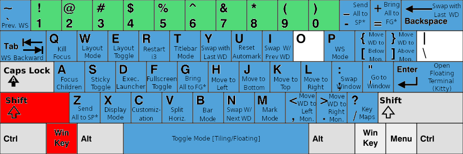

# I3_Sway_Config
Backup for my I3WM(Xorg), <s>SwayWM(Wayland)</s>,
and configurations of applications for the working environment in Xorg, <s>Wayland</s>

Table of Contents
=================
<details open>
<summary>Click to expand/shrink</summary>

* [I3_Sway_Config](#i3_sway_config)
* [Table of Contents](#table-of-contents)
* [Context](#context)
   * [Section 1 - Demo Current Customization](#section-1---demo-current-customization)
   * [Section 2 - Details of i3 Environment](#section-2---details-of-i3-environment)
      * [1. My i3 Environment](#1-my-i3-environment)
      * [2. Programs Auto-start in Background for i3 Environment](#2-programs-auto-start-in-background-for-i3-environment)
      * [3. Wallpapers](#3-wallpapers)
      * [4. Theme and Fonts](#4-theme-and-fonts)
   * [Section 3 - First Time Usage for i3](#section-3---first-time-usage-for-i3)
      * [1. Configuration distributor](#1-configuration-distributor)
      * [2. Optional Configuration](#2-optional-configuration)
   * [Section 4 - Mode Usage for i3](#section-4---mode-usage-for-i3)
      * [1. Mode Usage](#1-mode-usage)
   * [Section 5 - Mouse Usage for i3](#section-5---mouse-usage-for-i3)
      * [1. Touchpad Usage](#1-touchpad-usage)
      * [2. Mouse Usage](#2-mouse-usage)
   * [Section 6 - Keybinding Sheet for i3](#section-6---keybinding-sheet-for-i3)
      * [1. Prefix: Winkey](#1-prefix-winkey)
      * [2. Prefix: Winkey + Shift](#2-prefix-winkey--shift)
      * [3. Prefix: Ctrl + Alt](#3-prefix-ctrl--alt)
      * [4. Miscellaneous](#4-miscellaneous)
   * [Reference for i3 Setup](#reference-for-i3-setup)

Created by [gh-md-toc](https://github.com/ekalinin/github-markdown-toc)

</details>

# Context
<details open>
<summary>Click to expand/shrink</summary>

## Section 1 - Demo Current Customization
<details open>
<summary>Click to expand/shrink</summary>


</details>

## Section 2 - Details of i3 Environment
<details>
<summary>Click to expand/shrink</summary>

### 1. My i3 Environment
<details>
<summary>Click to expand/shrink</summary>

- i3 Window Manager: [i3-gap](https://github.com/Airblader/i3) `4.20.1`
- Shell: [fish](https://github.com/fish-shell/fish-shell) `3.4.1` + [oh-my-fish](https://github.com/oh-my-fish/oh-my-fish) `7`
- Terminal: [kitty](https://github.com/kovidgoyal/kitty) `0.21.2`
- Launcher: [rofi](https://github.com/davatorium/rofi) `1.7.3`
- Theme Configurer: [pywal](https://github.com/dylanaraps/pywal) `3.3.1`
- Xcompositor: [picom](https://github.com/jonaburg/picom) `vgit-a8445`
- Notification: [dunst](https://github.com/dunst-project/dunst) `1.8.0`
- Status Bar: [default i3bar](https://i3wm.org/docs/userguide.html#_configuring_i3bar) `4.20.1` + [bumblebee-status](https://github.com/tobi-wan-kenobi/bumblebee-status) `2.0.5`
- Text Editor: [neovim](https://github.com/neovim/neovim) `0.6.1` + [my configuration](https://github.com/JordanWu1997/Vim_Tmux_Config)
- Terminal Multiplexer: [tmux](https://github.com/tmux/tmux) `3.1c` + [my configuration](https://github.com/JordanWu1997/Vim_Tmux_Config)

</details>

### 2. Programs Auto-start in Background for i3 Environment
<details>
<summary>Click to expand/shrink</summary>

- [xrandr](https://www.x.org/wiki/Projects/XRandR/): multi-monitor window arrangement
- [pywal](https://github.com/dylanaraps/pywal): color theme autotune by wal
- [feh](https://github.com/derf/feh): image viewer, wallpaper changer
- [conky](https://github.com/brndnmtthws/conky): system monitor for X window
- [polkit-gnome](https://fedora.pkgs.org/33/fedora-x86_64/polkit-gnome-0.106-0.7.20170423gita0763a2.fc33.x86_64.rpm.html): gnome-software support
- [NetworkManger](https://fedoraproject.org/wiki/Tools/NetworkManager): network-manager
- [blueman](https://fedoraproject.org/wiki/Features/Blueman): bluetooth manager
- [imwheel](http://imwheel.sourceforge.net/): mouse speed manager
- [ibus-chewing](https://github.com/definite/ibus-chewing): input method for chewing
- [xss-lock](https://bitbucket.org/raymonad/xss-lock/src/master/): Xsession lock
- [parcellite](https://github.com/rickyrockrat/parcellite): clipboard applet
- [flashfocus](https://github.com/fennerm/flashfocus): flash when changing focus
- [dunst](https://github.com/dunst-project/dunst): notification
- [kdeconnectd](https://community.kde.org/KDEConnect): mobile phone connector
- [bumblebee-status](https://github.com/tobi-wan-kenobi/bumblebee-status): i3 status bar information support
- [rjekker/i3-battery-popup](https://github.com/rjekker/i3-battery-popup): battery warning for laptop
- [lincheney/i3_automark.py](https://github.com/lincheney/i3-automark/blob/master/i3-automark.py): auto mark i3 window
- [nwg-piotr/autotiling.py](https://github.com/nwg-piotr/autotiling): auto tiling i3 container (Horizontal -> Vertical -> Horizontal -> ...)
- [jonaburg/picom](https://github.com/jonaburg/picom): X11 compositor for blur, transparency, animation support
- [Airblader/unclutter-xfixes](https://github.com/Airblader/unclutter-xfixes): auto-hide mouse cursor

</details>

### 3. Wallpapers
<details>
<summary>Click to expand/shrink</summary>

- Default Wallpapers: [Arc Dark Fedora Wallpaper](https://www.reddit.com/r/Fedora/comments/8zji6j/by_request_clean_and_simple_arc_dark_fedora/)
- Default Lock screen wallpaper: [Thinkpad Trackpoint Wallpaper](https://www.wallpaperflare.com/thinkpad-lenovo-full-frame-close-up-no-people-pattern-indoors-wallpaper-hivip)
- [Optional] More wallpapers from dt: [Wallpapers](https://gitlab.com/dwt1/wallpapers)
- [Optional] Fedora 33/34 built-in logo: [Logos](https://en.wikipedia.org/wiki/Fedora_(operating_system))

</details>

### 4. Theme and Fonts
<details>
<summary>Click to expand/shrink</summary>

- [Optional] Theme: [Arc-Dark-solid](https://github.com/horst3180/arc-theme)
- [Optional] Icon: [Papirus dark](https://www.gnome-look.org/p/1166289/)
- [Optional] GUI font: [SAN regular](https://fonts.google.com/specimen/Open+Sans)
- [Optional] TUI font: [DroidSansMono Nerd Font Bold](https://github.com/ryanoasis/nerd-fonts/blob/master/patched-fonts/DroidSansMono/complete/Droid%20Sans%20Mono%20Nerd%20Font%20Complete%20Mono.otf)

</details>
</details>

## Section 3 - First Time Usage for i3
<details>
<summary>Click to expand/shrink</summary>

### 1. Configuration distributor
<details>
<summary>Click to expand/shrink</summary>

- Run distributor in this git repository `./config/i3/script/i3_config_distributor.sh`
- Including
    - __Add Environment Variables__
        - Add `I3_SCRIPT` to `$PATH` in `$HOME/.profile`
        - Add `I3_SCRIPT` in `"$HOME/.profile`
    - __Backup Old Configuration and Link New Configuration__
        - Backup old configuration file `$HOME/.config/*` to `$HOME/.config_backup` directory
        - Link configuration in git repository `config/*` to `$HOME/.config` directory
    - __Install Programs for Work Environment__

</details>

### 2. Optional Configuration
<details>
<summary>Click to expand/shrink</summary>

- [Optional] Add following lines for pywal color support for bash/zsh/fish, no need for kitty terminal emulator
    ```
    # Add following line to .bashrc/.zshrc/config.fish
    [ -f {$HOME}/.cache/wal/sequences ] && /usr/bin/cat {$HOME}/.cache/wal/sequences
    ```

</details>
</details>

## Section 4 - Mode Usage for i3
<details>
<summary>Click to expand/shrink</summary>

- i3 has a built-in mode function that overwrites current keybinding with preset mode keybinding
- When i3 mode is on, mode keybinding instruction shows on the i3 status bar
- Press the `Esc` key to exit mode
- This part configuration can be found in
    - `./config/i3/configs/i3_custom.config`
    - `./config/i3/configs/i3_mode.config`

### 1. Mode Usage
<details>
<summary>Click to expand/shrink</summary>

- __System Mode (`[Winkey]` + `[Shift]` + `[Esc]`)__
    - System command, e.g. exit, power off, reboot, lock, hibernate, caffeine function
- __Display Mode (`[Winkey]` + `[Shift]` + `[x]`)__
    - Deal with dual monitor, e.g. joint monitor, mirror monitor
- __Red Shift Mode (`[Winkey]` + `[Shift]` + `[z]`)__
    - Screen color temperature tuner
- __Dunst Mode (`[Winkey]` + `[Shift]` + `[v]`)__
    - Dunst actions, including stopping or resuming dunst
- __Mouse Mode (`[Ctrl]` + `[Alt]` + `[m]`)__
    - Mouse emulator using keyboard, e.g. move, left/right click, cursor auto-hide
- __Resize Mode (`[Ctrl]` + `[Alt]` + `[r]`)__
    - Resize focused window
- __Gap Mode (`[Winkey]` + `[Shift]` + `[g]`)__
    - Modify i3 gaps, e.g. inner gaps, outer gaps
- __Title Bar Mode (`[Winkey]` + `[Shift]` + `[t]`)__
    - Modify i3 title bar, e.g. hide/show title bar, font, border
        - __Border Mode (`[b]`)__
            - Modify i3 border
- __Mark Mode (`[Winkey]` + `[Shift]` + `[m]`)__
    - Mark window, go to/swap marked window, auto-mark function
- __Window Layout Mode (`[Winkey]` + `[Shift]` + `[w]`)__
    - Change i3 window layout, e.g. tiling, tabbed, stacking mode, auto-tiling function
- __Workspace Mode (`[Winkey]` + `[Shift]` + `[p]`)__
    - Manipulate i3 workspace, e.g. swap, save, restore
        - __Swap Workspace Mode (`[p]`)__
            - Swap workspace
        - __Save Workspace Mode (`[s]`)__
            - Save workspace layout
        - __Restore Workspace Mode (`[r]`)__
            - Restore workspace layout
- __Customization Mode (`[Winkey]` + `[Shift]` + `[c]`)__
    - Customize i3wm, e.g. wallpaper, theme, xcompositor
        - __Border Mode (`[b]`)__
            - Container border color scheme
        - __Conky Mode (`[c]`)__
            - System_monitor, i3 bindkey sheet, conky color palette
        - __Picom Mode (`[p]`)__
            - Blur, transparency support
        - __Flashfocus Mode (`[f]`)__
            - Flash for overall program in picom blur, transparency and opaque
        - __Theme Mode (`[t]`)__
            - Auto-theme with pywal and reload applications after auto-theming
        - __Wallpaper Mode (`[w]`)__
            - Select wallpaper, set default wallpaper
- __Bar Mode (`[Winkey]` + `[Shift]` + `[b]`)__
    - Show/hide i3bar, set default i3bar status (show/hide), reload i3bar

</details>
</details>

## Section 5 - Mouse Usage for i3
<details>
<summary>Click to expand/shrink</summary>

- Although the keyboard-driven workflow is favored in i3, keeping mouse function has no harm
- This part configuration can be found in
    - `./config/i3/configs/i3_bindkey.config`

### 1. Touchpad Usage
<details>
<summary>Click to expand/shrink</summary>

- __2-finger Gesture__
    - __Tap__
        - Right key click
    - __Swipe__
        - Scroll
- __3-finger Gesture__
    - __Tap__
        - Middle key click
    - __Swipe Up__
        - Toggle window full-screen mode
    - __Swipe Down__
        - Toggle floating mode
    - __Swipe Left__
        - Go to previous workspace
    - __Swipe Right__
        - Go to next workspace
- __4-finger Gesture__
    - __Pinch Out__
        - Bring window in scratchpad to foreground
    - __Pinch In__
        - Send window to scratchpad

</details>

### 2. Mouse Usage
<details>
<summary>Click to expand/shrink</summary>

- __Middle Key__
    - __Click Title Bar__
        - Kill current window
    - __`[Winkey]` + Click__
        - Kill current window
- __Right Key__
    - __Click Title Bar__
        - Toggle floating mode
    - __`[Winkey]` + Click__
        - Toggle floating mode
- __Scroll Wheel__
    - __Scroll Up Title Bar__
        - Send to scratchpad
    - __Scroll Down Title Bar__
        - Toggle floating mode

</details>
</details>

## Section 6 - Keybinding Sheet for i3
<details>
<summary>Click to expand/shrink</summary>

- Cheat sheet format, color theme here is the same as the i3 user guide
- All following keybindings can be configured in
    - `./config/i3/configs/i3_bindkey.config`
    - `./config/i3/configs/i3_workspace.config`

### 1. Prefix: Winkey
<details open>
<summary>Click to expand/shrink</summary>



</details>

### 2. Prefix: Winkey + Shift
<details open>
<summary>Click to expand/shrink</summary>



</details>

### 3. Prefix: Ctrl + Alt
<details open>
<summary>Click to expand/shrink</summary>


- __Program shortcut (1~9, 0, -, =)__
    - `1`: [Neovim (text editor)](https://neovim.io/)
    - `2`: [Ranger (file manager)](https://github.com/ranger/ranger)
    - `3`: [Pulsemixer (audio manager)](https://pypi.org/project/pulsemixer/)
    - `4`: [Htop (system monitor)](https://htop.dev/)
    - `5`: [Nmtui (network manager)](https://developer.gnome.org/NetworkManager/stable/nmtui.html)
    - `6`: [Cava (audio visualizer)](https://github.com/karlstav/cava)
    - `7`: [Spt (spotify-tui)](https://github.com/Rigellute/spotify-tui)
    - `8`: [Zathura (document viewer)](https://github.com/pwmt/zathura)
    - `9`: [Blueman (bluetooth manager)](https://github.com/blueman-project/blueman)
    - `0`: [Nautilus (GUI file manager)](https://wiki.gnome.org/action/show/Apps/Files?action=show&redirect=Apps%2FNautilus)
    - `-`: [Brave browser (web browser)](https://brave.com/)
    - `=`: [Firefox (web browser)](https://www.mozilla.org/en-US/firefox/)

</details>

### 4. Miscellaneous
<details>
<summary>Click to expand/shrink</summary>

- __Go to Workspace (Absolutely)__
    - `[Winkey]` + `[Number(#)]`: Go to workspace number # (A#) in monitor 1 (eDP1)
    - `[Winkey]` + `[Function(F#)]`: Go to workspace number 10+# (B#) in monitor 2 (HDMI1)
    - `[Ctrl]` + `[Function(#)]`: Go to workspace number 20+# (C#) in monitor 3 (VIRTUAL1)
    - `[Alt]` + `[Function(#)]`: Go to workspace number 30+# (D#) in monitor 4 (VIRTUAL2)
- __Go to Workspace (Relatively)__
    - `[Winkey]` + (`[Shift]`) + `[Tab]`: Go to (prev)/next workspace
    - `[Winkey]` + (`[Shift]`) + `[Grave]`: Go to (prev)/next workspace (create one if it does not exist)
    - `[Winkey]` + `[Ctrl]` + `[Tab]`: Go to next workspace back and forth
    - `[Ctrl]` + `[Alt]` + `[Left/Right]`: Gnome-like workspace operation. Move to (prev)/next workspace (create one if it does not exist)
- __Swap Workspace (Relatively)__
    - `[Winkey]` + (`[Shift]`) + `[Ctrl]` + `[Grave]`: Swap (prev)/next workspace (create one if it does not exist)
- __Send Window to Workspace (Absolutely)__
    - `[Winkey]` + `[Shift]` + `[Number(#)]`: Send to workspace number # (A#) in monitor 1 (eDP1), Note: # < 11
    - `[Winkey]` + `[Shift]` + `[Function(F#)]`: Send to workspace number 10+# (B#) in monitor 2 (HDMI1), Note: # < 11
    - `[Ctrl]` + `[Shift]` + `[Function(F#)]`: Send to workspace number 20+# (C#) in monitor 3 (VIRTUAL1), Note: # < 11
    - `[Alt]` + `[Shift]` + `[Function(F#)]`: Send to workspace number 30+# (D#) in monitor 4 (VIRTUAL2), Note: # < 11
- __Send Window to Workspace (Relatively)__
    - `[Alt]` + (`[Shift]`) + `[Grave]`: Send to (prev)/next workspace
    - `[Ctrl]` + `[Alt]` + `[Shift]` + `[Left/Right]`: Gnome-like workspace operation. Send to (prev)/next workspace (create one if it does not exist)
- __Move between Windows__
    - `[Alt]` + (`[Shift]`) + `[Tab]`: Show all window list on (current)/all displays
    - __Manipulate Scratchpad__
    - `[Winkey]` + `[-]`: Send focused window to the scratchpad (background)
    - `[Winkey]` + `[Shift]` + `[-]`: Send all floating windows to scratchpad (background)
    - `[Winkey]` + `[=]`: Bring window in scratchpad to foreground one by one
    - `[Winkey]` + `[Shift]` + `[=]`: Bring all windows in scratchpad to foreground
- __Change Gap Size__
    - `[Ctrl]` + `[Alt]` + `[Shift]` + `[h/l]`: Decrease/Increase horizontal outer gap size
    - `[Ctrl]` + `[Alt]` + `[Shift]` + `[j/k]`: Decrease/Increase vertical outer gap size
    - `[Ctrl]` + `[Alt]` + `[Shift]` + `[m/p]`: Decrease/Increase inner gap size
    - `[Ctrl]` + `[Alt]` + `[Shift]` + `[o]`: Restore to default outer gap size
    - `[Ctrl]` + `[Alt]` + `[Shift]` + `[i]`: Restore to default inner gap size
- __Screenshot__
    - `[PrtSc]`: Flameshot (screenshot tool)
    - `[Winkey]` + `[PrtSc]`: Gnome-screenshot for the current window
    - `[Winkey]` + `[Shift]` + `[PrtSc]`: Gnome-screenshot interactive mode

</details>
</details>

## Reference for i3 Setup
<details>
<summary>Click to expand/shrink</summary>

- https://i3wm.org/docs/userguide.html
- https://wiki.archlinux.org/title/I3
- https://github.com/Airblader/i3 (i3-gap)
- https://github.com/levinit/i3wm-config (written in Chinese)
- https://www.itread01.com/p/142448.html (written in Chinese)
- https://segmentfault.com/a/1190000022083424 (written in Chinese)
- https://github.com/alberto-santini/i3-configuration-x1
- https://pypi.org/project/i3-resurrect/
- https://pypi.org/project/i3-workspace-swap/
- https://github.com/rjekker/i3-battery-popup
- https://github.com/lincheney/i3-automark
- https://www.youtube.com/watch?v=j1I63wGcvU4&list=PL5ze0DjYv5DbCv9vNEzFmP6sU7ZmkGzcf

</details>
</details>
</details>
