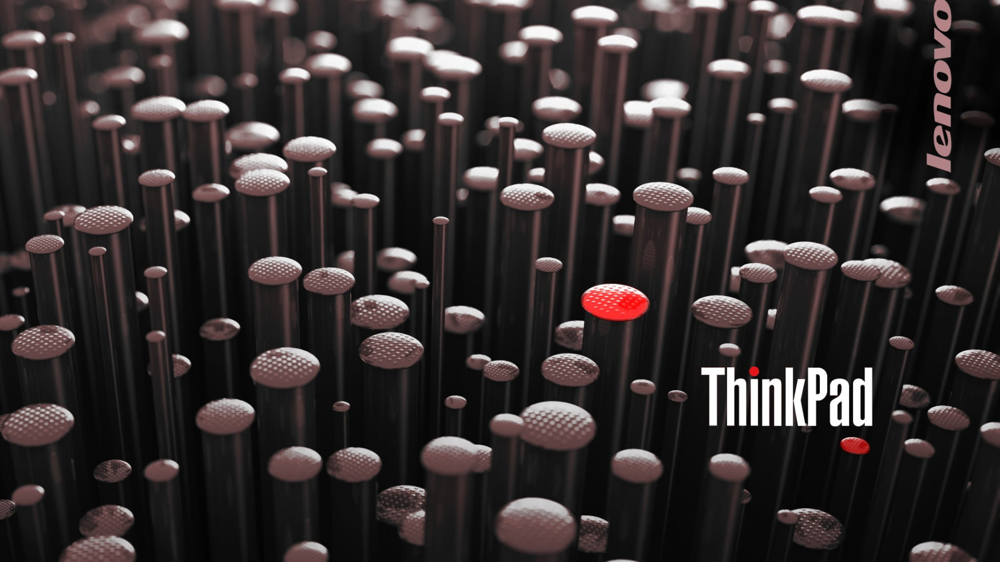

# I3 Share Directory

Table of Contents
=================

* [I3 Share Directory](#i3-share-directory)
   * [Texts](#texts)
   * [Images](#images)
      * [Default Wallpapers](#default-wallpapers)
      * [Logos](#logos)
      * [Icons](#icons)

Created by [gh-md-toc](https://github.com/ekalinin/github-markdown-toc)

# Context

## Texts
- `app-icons.json`
    - Unicode list for applications (required by [i3-workspace-names-daemon](https://github.com/cboddy/i3-workspace-names-daemon))
- `i3_workspace_name.txt`
    - i3 workspace name list (required by `../script/i3_workspace_operator.sh` and `../script/i3_new_workspace.sh`)

## Images
- `default_wallpaper`
    - Image for `pywal`/`feh` startup wallpaper
    - Set by `../script/i3_wallpaper_operator.sh`

### Default Wallpapers

- `default_fedora_wallpaper_1.png`

- `default_fedora_wallpaper_2.png`

- `default_i3_wallpaper.png`

- `default_thinkpad_wallpaper.png`

### Logos

- `fedora_logo_darkbackground.png`

- `fedora_logo_white.png`

- `fedora_logo_blue.png`

- `ubuntu_logo_darkbackground.png`

- `ubuntu_logo_darkbackground.png`

### Icons
- Resources
    - https://www.flaticon.com/

