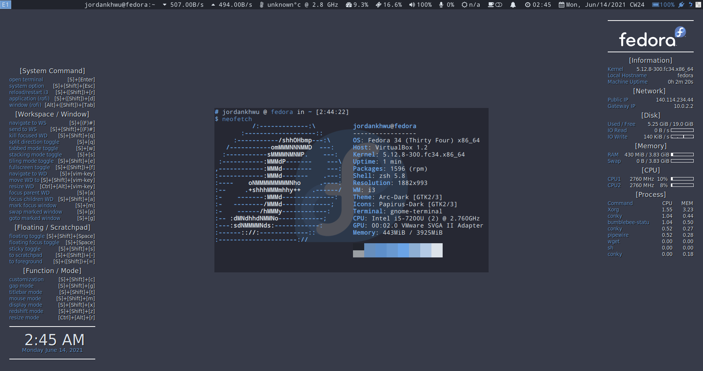

# Installation for i3 and my customization
Here use [Feodra 34 i3 Spin](https://spins.fedoraproject.org/en/i3/) as demo for installation

1. Install virtualbox (Only for virtual machine in virtualbox)
    ```
    dnf install virtualbox-guest-additions
    ```

2. Enable Fedora 3rd party repository
    ```
    dnf install https://download1.rpmfusion.org/free/fedora/rpmfusion-free-release-$(rpm -E %fedora).noarch.rpm
    dnf install https://download1.rpmfusion.org/nonfree/fedora/rpmfusion-nonfree-release-$(rpm -E %fedora).noarch.rpm
    dnf update
    ```

3. Install i3-gap
    Original i3 comflicts with i3-gaps (Only for Fedora i3 spin)
    If original i3 is removed, must remember to reinstall terminal emulator
    ```
    dnf copr enable fuhrmann/i3-gaps
    dnf remove i3
    dnf install i3-gaps kitty gnome-terminal
    ```

4. Install system utility package
    ```
    dnf install git i3lock xss-lock rofi htop neofetch vim ranger zsh
    dnf install pavucontrol dunst parcellite numlockx xdotool conky
    dnf install NetworkManager blueman arandr xrandr xbacklight redshift
    ```

5. Install Xcompositor
- Option 1: Xcompmgr
    - Xcompmgr cannot be installed from repository of Fedora 34 spin i3. Here change to mannually installation from [here](https://centos.pkgs.org/8/raven-x86_64/xcompmgr-1.1.7-7.el8.x86_64.rpm.html)
    ```
    cd ~/ && wget https://pkgs.dyn.su/el8/base/x86_64/xcompmgr-1.1.7-7.el8.x86_64.rpm
    dnf install ./xcompmgr-1.1.7-7.el8.x86_64.rpm
    ```
- Option 2: Picom
    - Note for Picom (Blur, animation support): Picom from repository of Fedora 34 does not contain all the functions we need (e.g. blur, fancy-animation) if you really need blur effect or fancy-animation, you need to mannually compile picom from [jonaburg fork](https://github.com/jonaburg/picom), but it needs a lot computating resources, not recommended for virtual machine.
    - Picom for Transparency support
        ```
        dnf install picom
        ```
    - Picom for Blur support (jonaburg-fork)
        ```
        dnf install meson gcc ninja-build cmake
        dnf install libev-devel xcb-util-devel libX11-devel xcb-util-renderutil-devel xcb-util-image xcb-util-image-devel
        dnf install xcb-util-renderutil-devel pixman-devel uthash-devel libconfig-devel pcre-devel mesa-libGL-devel dbus-devel libXext-devel
        cd ~/
        git clone https://github.com/jonaburg/picom.git
        git submodule update --init --recursive
        meson --buildtype=release . build
        ninja -C build
        ```
6. Install wallpaper package
```
dnf install feh variety
```

7. Input method (for chewing user)
```
dnf install ibus ibus-chewing
```

8. Install gnome package
```
dnf install nautilus gnome-screenshot
```

9. Install theme configurator
```
dnf install lxappearance
dnf install gtk-chtheme
dnf install qt-config qt5ct qt5-qtstyleplugins
dnf install arc-theme papirus-icon-theme
```

10. Install Python package for i3
```
python -m pip install pywal bumblebee-status i3ipc utils i3-resurrect i3-workspace-swap autotiling flashfocus
```
- Bumblebee-status [Additional dependencies]
    ```
    # caffeine
    dnf install gnome-shell-extension-caffeine
    # network_traffic modules
    dnf install python-netifaces
    # sensors module
    dnf install lm_sensors
    # pasink, pasource  modules
    dnf install pulseaudio-utils
    ```

11. Install Nerd fonts
```
mkdir -p ~/.local/share/fonts
cd ~/.local/share/fonts
curl -fLo "Droid Sans Mono for Powerline Nerd Font Complete.otf" https://github.com/ryanoasis/nerd-fonts/raw/master/patched-fonts/DroidSansMono/complete/Droid%20Sans%20Mono%20Nerd%20Font%20Complete.otf
```

12. Install oh-my-zsh
```
sh -c "$(curl -fsSL https://raw.githubusercontent.com/ohmyzsh/ohmyzsh/master/tools/install.sh)"
```

13. Load my i3 configuration
- Link all configuration
    ```
    cd ~ && mkdir Desktop
    git clone https://github.com/JordanWu1997/I3_Sway_Config.git
    cd ~/.config/ && rm i3 kitty dunst ranger rofi -fr
    ln -s ~/Desktop/I3_Sway_Config/config/i3
    ln -s ~/Desktop/I3_Sway_Config/config/kitty/
    ln -s ~/Desktop/I3_Sway_Config/config/dunst
    ln -s ~/Desktop/I3_Sway_Config/config/ranger
    ln -s ~/Desktop/I3_Sway_Config/config/rofi
    ln -s ~/Desktop/I3_Sway_Config/config/picom
    ln -s ~/Desktop/I3_Sway_Config/config/bumblebee-status
    ln -s ~/Desktop/I3_Sway_Config/config/vis
    ```
- Add following command to ~/.profile
    ```
    export PATH=$HOME/.config/i3/bin:$PATH
    export PATH=$HOME/.local/bin:$PATH
    export I3_BIN=$HOME/.config/i3/bin
    ```

- Add following command to ~/.zshrc
    ```
    source "$HOME/.profile"
    cat /home/jordankhwu/.cache/wal/sequences
    ```

- Set default wallpaper
    ```
    rm -f ~/.config/i3/share/default_wallpaper
    $HOME/.config/i3/bin/i3_set_default_wallpaper_feh.sh
    ```

- Note for conky
    ```
    ln -s ~/Desktop/I3_Sway_Config/config/conky
    ```
    - After conky installation, remeber to tune cpu number to make system conky work

15. Load my neovim, tmux configuration
```
dnf install neovim tmux tmux-powerline
cd ~/Desktop
git clone https://github.com/JordanWu1997/Vim_Tmux_Config.git
git clone https://github.com/tmux-plugins/tpm ~/.tmux/plugins/tpm
ln ~/Desktop/Vim_Tmux_Config/tmux.conf ~/.tmux.conf
ln -s ~/Desktop/Vim_Tmux_Config/vimrc ~/.config/nvim/init.vim
```

16. Final result demo

